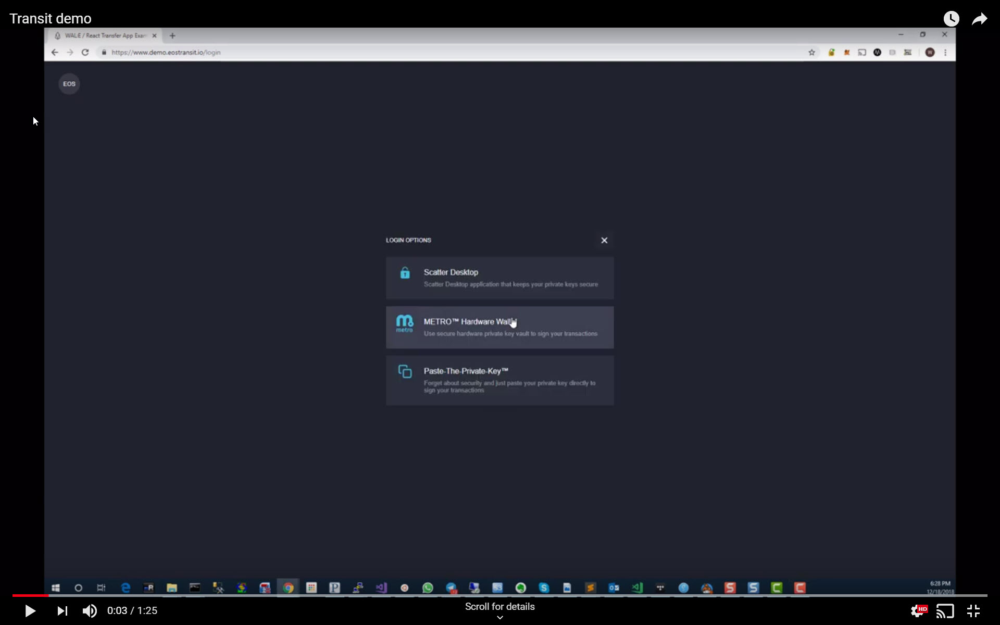
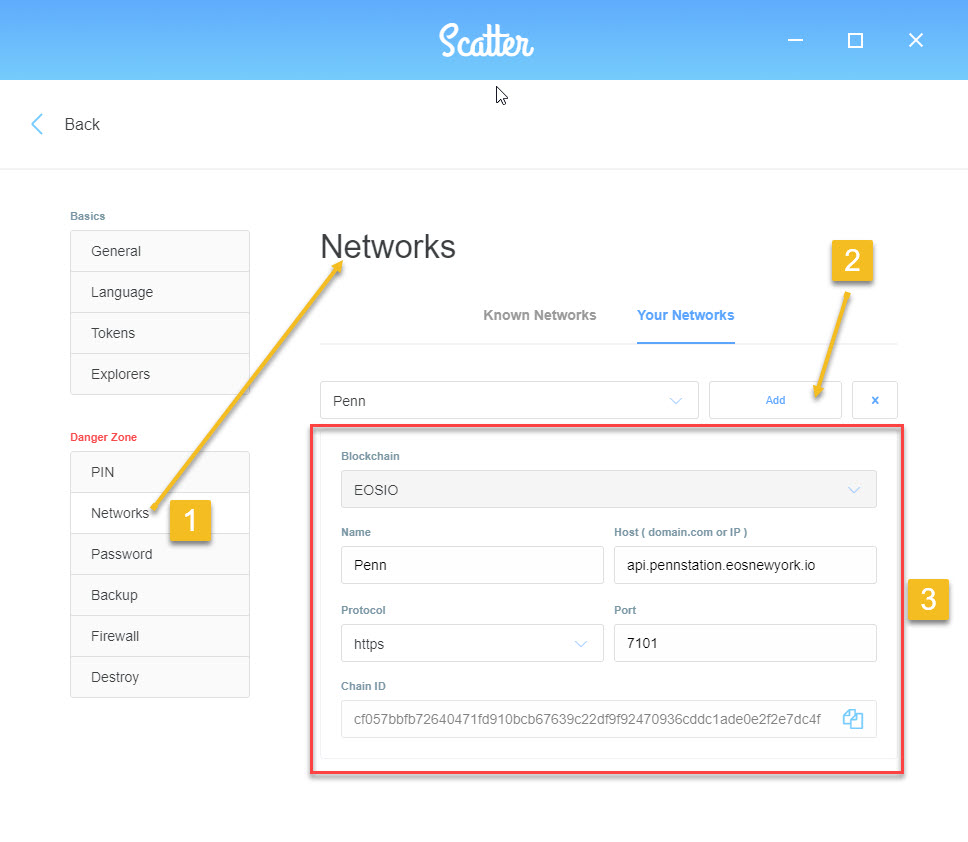
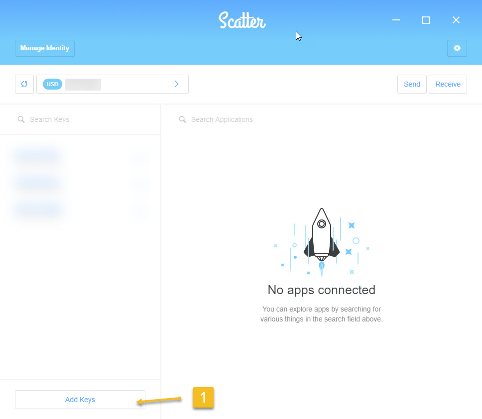
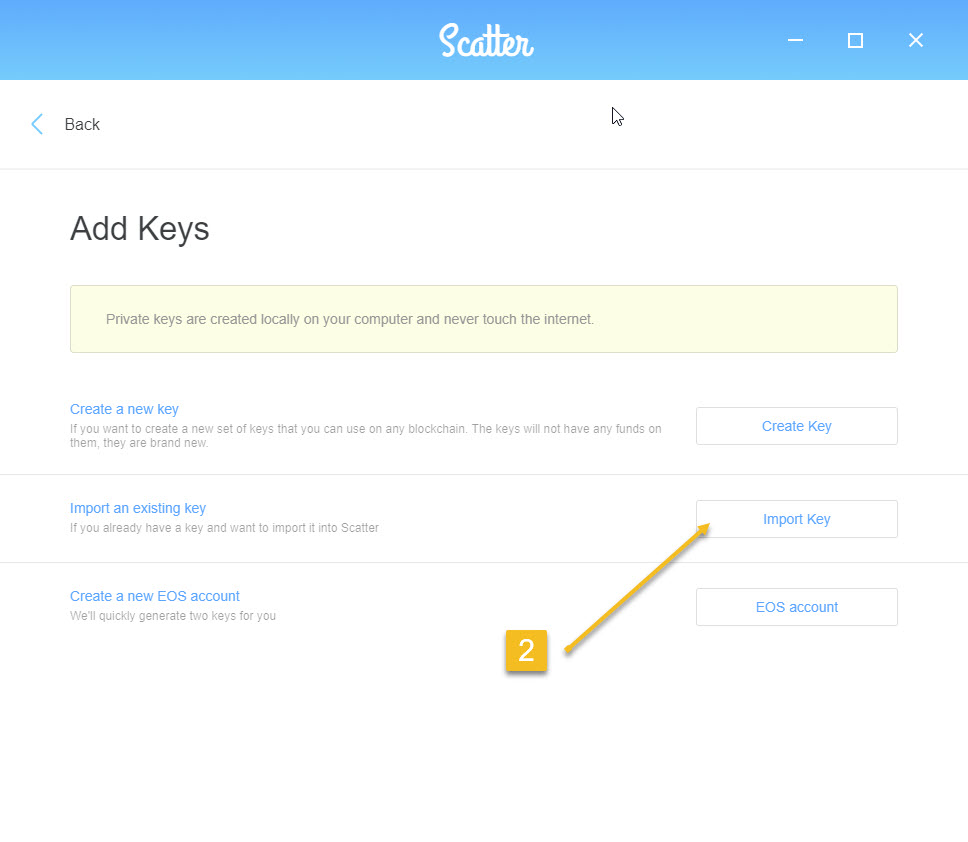
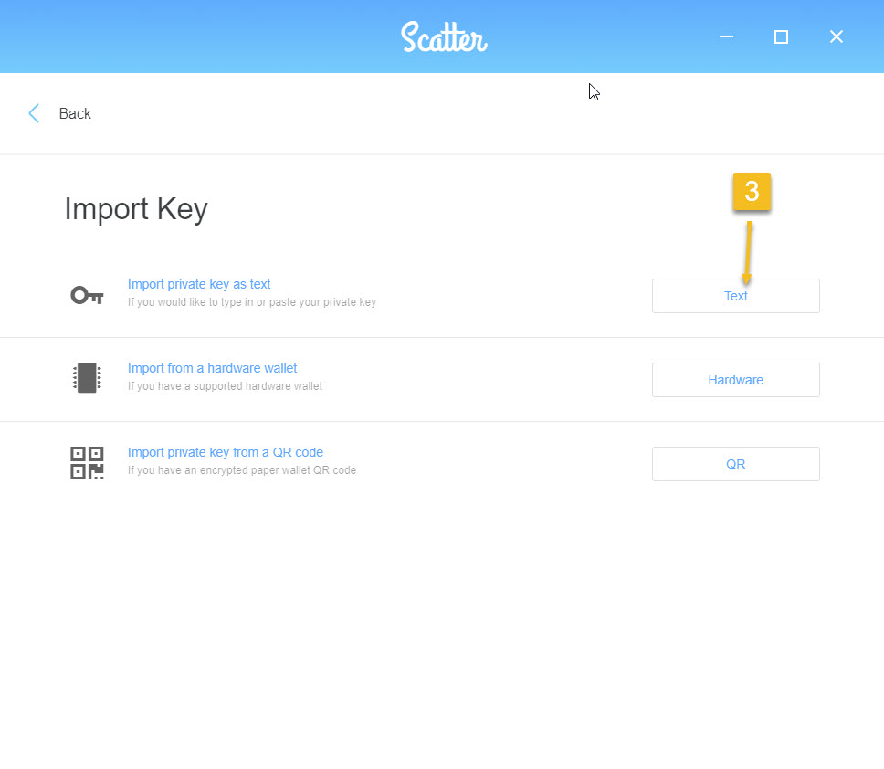
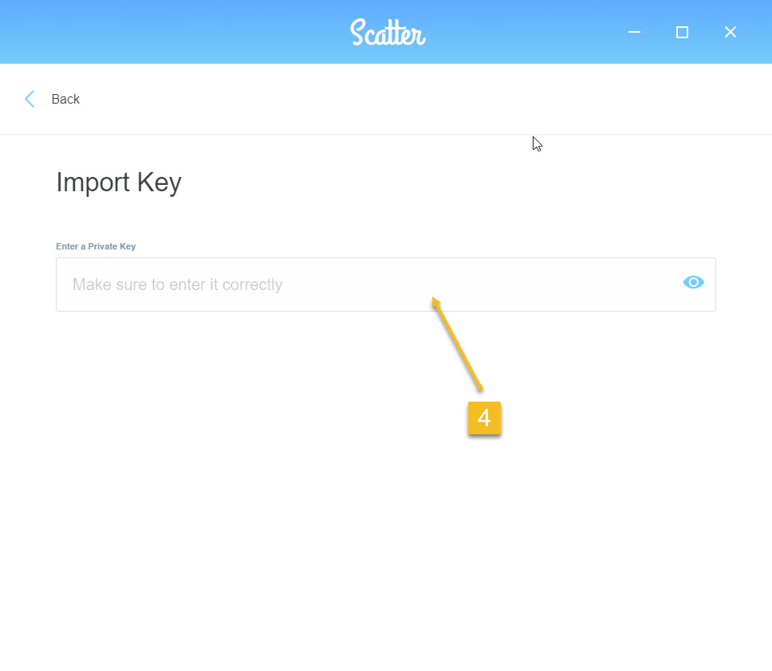
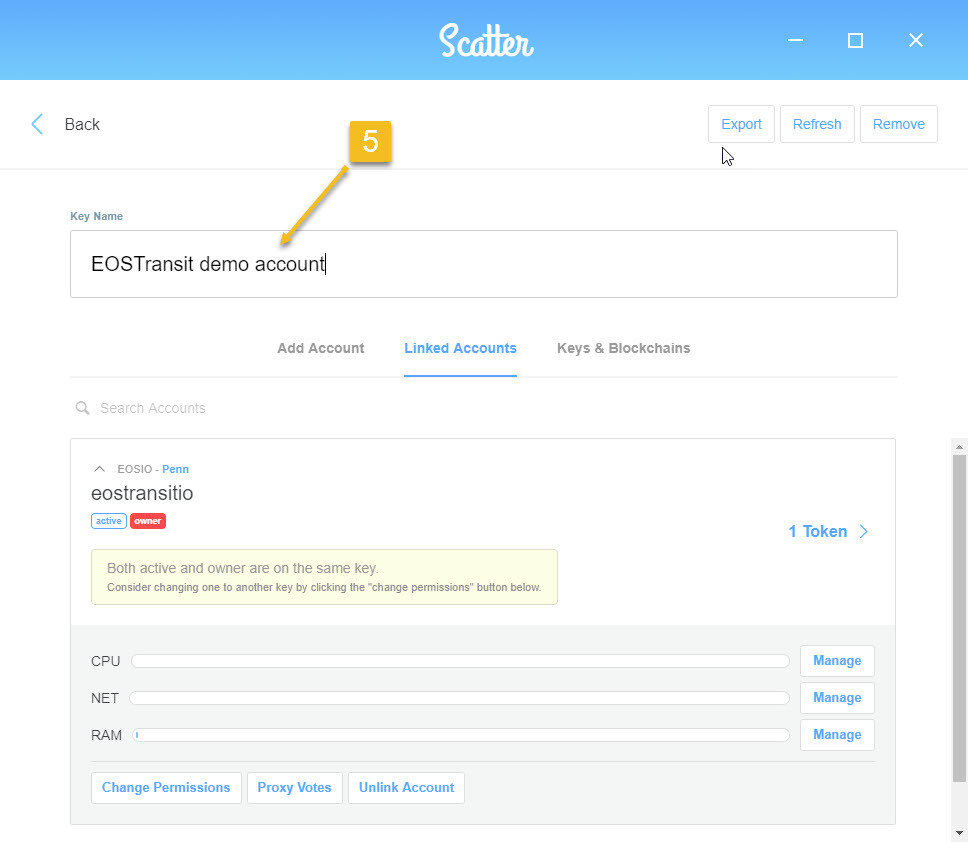

# wal-react-basic

This is an example of running a `transfer` transaction via WAL:E wallet providers (currently works via `Scatter Desktop` only).

## Demo (Video)

## Demo (Try it yourself)

http://demo.eostransit.io (Make sure you have scatter configured as per below)

### Scatter-Config

The demo is configured to connect to one of the the EOS New York test networks (PennStation). 

In order to interact with the demo, you'll need to:    
A. Have Scatter Desktop installed   
B. Add the PennStation network to Scatter desktop   
C. Add the "eostransitio" to scatter.   

#### A. Have Scatter Desktop installed   

Can be downloaded here:  https://github.com/GetScatter/ScatterDesktop/releases/

#### B. Add the PennStation network to Scatter desktop   

Go into the Scatter settings, then: 
1. Click Networks. 
2. Add a new network
3. Use the following details as shown in the picture below:   
        - Name: EOSIO  
        - Name: Penn  
        - Host: api.pennstation.eosnewyork.io  
        - Protocol: https  
        - Port: 7101  
        - ChainID: cf057bbfb72640471fd910bcb67639c22df9f92470936cddc1ade0e2f2e7dc4f
  

#### C. Add the "eostransitio" to scatter.   

1. Click "Add Keys"

2. Click "Import Key"

3. Click "Text"

4. Paste the following private key "5HsFbNxsRAxPimCakneKtnDnidoj6fQf9uSEMuUiJw2VqkB2i4W" 

5. Name the account "EOSTransit demo account"

That it you should be ready to test http://demo.eostransit.io

## Developer Quick start

### Prerequisites

Make sure you have [`yarn`](https://yarnpkg.com) installed.

### Setup

1.  Install the dependencies.
   
    **Note** that before `eos-transit`, `eos-transit-scatter-provider` and `eos-transit-stub-provider` are published, they are managed by `lerna` along with packages themselves. That means, before running the examples, `lerna` should wire up all the dependencies and instead of running `yarn install` manually from this folder, the following commands should be run from the project root:

        $ yarn bootstrap
        $ yarn build-packages

    This will make `lerna` install all the necessary dependencies.

2.  Start the development server with (from this example folder root this time):

        $ yarn start

3.  Access the server at [`localhost:3300`](http://localhost:3300) (or whatever `PORT` you configured to run the development server for `create-react-app`).
